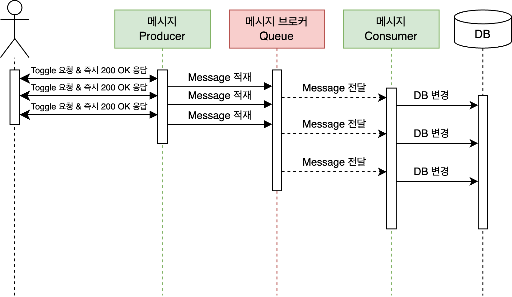
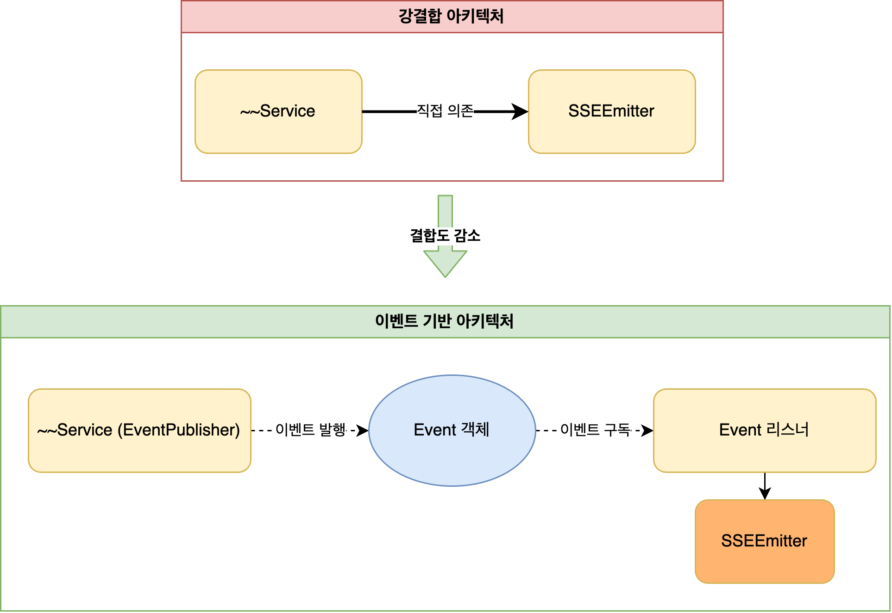
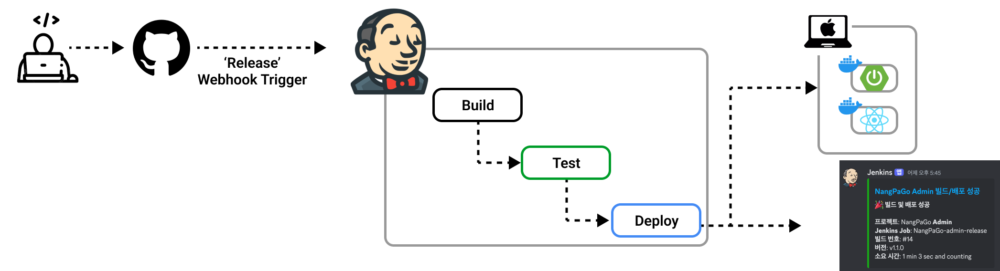
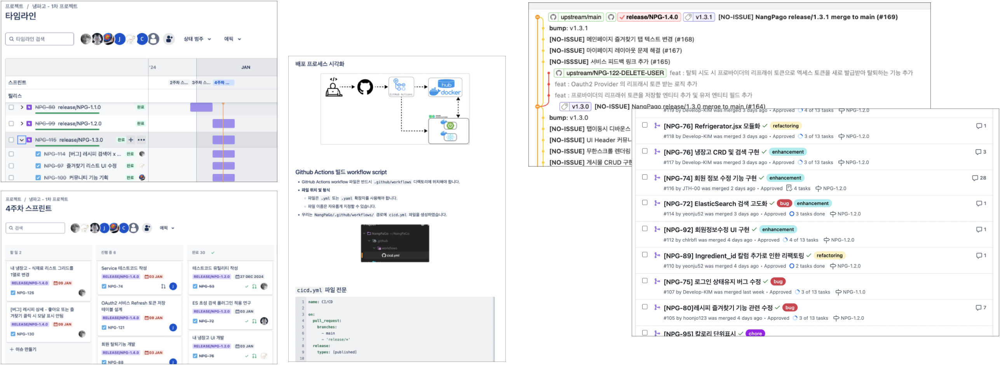

# 🧑‍💻문철현 - 담당 역할 & 기여 내용

### 1. 코드 통일성을 위한 공통 코드 개발, 팀 코드 템플릿으로 적용
- `RuntimeException` 을 상속받은 **커스텀 Global 예외 처리 클래스** 개발
  - [GlobalExceptionHandler](NangPaGo-api/NangPaGo-common/src/main/java/com/mars/common/exception/GlobalExceptionHandler.java)
- 예외 코드를 Enum으로 표준화하여 타입 안정성 확보, 오타 방지
  - [NPGExceptionType](NangPaGo-api/NangPaGo-common/src/main/java/com/mars/common/exception/NPGExceptionType.java)

```java
// 예외 처리 예시 
public UserResponseDto getCurrentUser(Long userId) {
    return UserResponseDto.from(userRepository.findById(userId)
      .orElseThrow(NPGExceptionType.NOT_FOUND_USER::of));  // 예외 타입을 Enum으로 설계
}
```

- 어노테이션으로 인증 로직 및 로그 기록을 처리하도록 AOP 활용
  - JWT 인증: [AuthenticationAspect](NangPaGo-api/NangPaGo-app/src/main/java/com/mars/app/aop/auth/AuthenticationAspect.java)
  - 방문 로그 기록: [VisitLogAspect](NangPaGo-api/NangPaGo-app/src/main/java/com/mars/app/aop/visit/VisitLogAspect.java)
  - 감사 로그 기록: [AuditLogAspect](NangPaGo-api/NangPaGo-app/src/main/java/com/mars/app/aop/audit/AuditLogAspect.java)

```java
// 어노테이션 활용 예시
@AuditLog(action = AuditActionType.COMMUNITY_CREATE,
          dtoType = CommunityRequestDto.class)
@Operation(summary = "게시물 작성")
@AuthenticatedUser
@PostMapping
public ResponseDto<CommunityResponseDto> create() {
  ...
  ...
}
```

---

### 2. 동시성 문제 해결을 위해 메시지 큐(RabbitMQ)를 도입, 비동기 처리
- [블로그 - 동시성 문제 해결을 위한 메시지 큐 사용기](https://cloverlaun.tistory.com/99)
- 시간 지연이 발생하는 데이터 처리를 비동기로 전환하여 사용자 **응답 시간 개선**
- 기존 조회 쿼리의 `@Lock` 을 제거하여 **DB 부하 감소** 효과
- RabbitMQ Config 코드 추상화, 공통 코드 분리
  - 추상 Interface: [RabbitMQConfig](NangPaGo-api/NangPaGo-common/src/main/java/com/mars/common/config/rabbitmq/RabbitMQConfig.java)
  - 구현 예제: [CommunityLikeRabbitConfig](NangPaGo-api/NangPaGo-app/src/main/java/com/mars/app/config/rabbitmq/impl/CommunityLikeRabbitConfig.java)
- 메시지 큐 기반 **비동기** 처리 Work Flow



---

### 3. Service 클래스 간 결합도 감소를 위한 이벤트 기반 아키텍처 구축
- Spring 내장 `ApplicationEvent` 활용
  - 구현 예제: SSE(Server-Sent-Event) 발송 코드 
    - Event 객체: [RecipeLikeEvent](NangPaGo-api/NangPaGo-app/src/main/java/com/mars/app/domain/recipe/event/RecipeLikeEvent.java)
    - Event 리스너: [RecipeLikeEventListener](NangPaGo-api/NangPaGo-app/src/main/java/com/mars/app/domain/recipe/event/RecipeLikeEventListener.java)
```java
// Event Publish 예제
public class RecipeLikeMessageConsumer {
    // Event 발생을 위한 Publisher
    private final ApplicationEventPublisher sseEventPublisher;
    // 이벤트 발생
    private void publishRecipeLikeEvent() {
        sseEventPublisher.publishEvent(
            RecipeLikeEvent.of({...})
        );
    }
}
```



---

### 4. Jenkins를 활용한 CI/CD 파이프라인 구축
- 서비스 다운타임 0건 달성을 위한 **Blue/Green 배포** 환경 구성
  - Jenkins 배포 스크립트: [Jenkinsfile](jenkins/nangpago-app/Jenkinsfile)
  - Blue/Green 배포 스크립트: [deploy.sh](deploy/nangpago-app/deploy.sh)
- 배포 절차 간소화
  - Github 저장소 "Releases" 신규 버전이 Publish 되었을 때 Webhook 발생
  - Jenkins는 Webhook을 수신하여 빌드를 유발
  - 팀 Discord 채널에 배포 성공/실패 여부 알림



---

### 5. macOS 홈 서버 구축 및 Docker 컨테이너 기반 인프라 시스템 관리 
- 임대료 부담 없이 지속 가능한 운영을 위해 홈 서버를 구축
- Docker 컨테이너 기반 인프라 시스템 구성 및 관리
  - Jenkins, Database(MySQL, MongoDB), RabbitMQ, Elasticsearch
- [블로그 - 맥북으로 홈 서버 구축하기](https://cloverlaun.tistory.com/100)

---

### 6. Agile 프로젝트 관리
- Jira 스프린트 및 티켓 할당을 통한 태스크 관리
- Confluence 를 이용한 기술 문서 관리, 지식 공유 체계 수립
- Github PR을 활용한 코드리뷰, Github Flow 협업 프로세스 구축



---

---

---


## 프로젝트 소개


### 🛠️ 사용 기술

**Backend**


**Database & Storage**


**Search Engine & Message Broker**


**DevOps & Infrastructure**

-000000?style=for-the-badge&logo=macos&logoColor=white)


**Frontend**


## 🕒 프로젝트 기간

2024.12.17 ~ 2025.02.13 **(2개월)** 


## 🎯 프로젝트 목적

- ElasticSearch 기반 자연어 검색 및 자동완성 기능 구현
- 직관적인 UI/UX를 통한 Seamless User Experience 제공
- RabbitMQ를 활용한 비동기 처리로 시스템 확장성 및 성능 향상
- SSE(Server-Sent Events) 기반 실시간 알림 시스템 구현
- GitHub Actions와 Jenkins를 활용한 CI/CD 파이프라인 구축으로 안정적인 배포 환경 조성
- 관리자 대시보드를 통한 사용자 활동 모니터링 및 서비스 분석 기능 제공


## 📈 기대효과

**사용자 편의성 증대**  
- ElasticSearch 기반 자연어 검색으로 오타, 초성/중성 분리를 통한 정확한 검색 결과 제공
- SSE를 활용한 실시간 알림으로 즉각적인 사용자 피드백 제공
- OAuth 2.0 기반 소셜 로그인으로 간편한 사용자 인증 지원
- Firebase Storage를 활용한 이미지 최적화로 빠른 콘텐츠 로딩 제공

**시스템 안정성 및 성능 향상**  
- RabbitMQ를 활용한 비동기 처리로 시스템 부하 분산 및 확장성 확보
- Blue-Green 배포 전략으로 무중단 서비스 제공
- Docker 컨테이너화를 통한 일관된 운영 환경 구성
- 분산 데이터베이스 구조(MySQL, MongoDB)로 데이터 처리 효율성 향상

**운영 효율성 개선**  
- GitHub Actions와 Jenkins를 활용한 CI/CD 파이프라인으로 배포 자동화
- Docker 기반 마이크로서비스 아키텍처로 서비스 독립성 확보
- 관리자 대시보드를 통한 통합 모니터링 환경 제공
- 체계적인 로깅 시스템으로 문제 상황 추적 용이

**데이터 관리 최적화**  
- ElasticSearch를 활용한 효율적인 데이터 검색 및 분석
- 정규화된 레시피 데이터 처리로 높은 데이터 품질 확보
- Firebase Storage의 이미지 최적화로 스토리지 비용 절감

---

## 🤝 협업 도구 & 워크플로우

### 🤼 협업 도구

**Task Management**


**Documents**


**Communication**


### 💼 워크플로우
- 작업 관리: Jira를 활용해 작업 티켓 생성 및 상태 추적.
- 문서 관리: Confluence에 프로젝트 설계 및 기술 문서 기록.
- CI 파이프라인: GitHub Actions로 빌드 & 테스트를 통한 검증 자동화
- 코드 리뷰: PR 작성 및 최소 1명 이상의 승인 후 병합.

---

## 💻 배포 환경

### 서버 아키텍처
#### 배포 URL: https://nangpago.site
- **자체 웹서버 구축**
  - 홈 네트워크에 포트 포워딩 설정, 여분의 macOS 랩탑(맥북)을 웹 서버로 구성하여 자체 서버 구축
- **Docker Compose 활용**
  - Backend, Frontend, DB, ElasticSearch, RabbitMQ, Jenkins 모두 컨테이너화.


### CI/CD 파이프라인

- **CI/CD 파이프라인 구성**
  - Git pre-push 훅을 통해 로컬 환경에서 테스트 자동 수행
    - 테스트 통과 시에만 원격 저장소 Push 허용
  - Pull Request 생성 시 GitHub Actions를 통한 자동 빌드 수행
  - Release 버전 생성 시 Jenkins Webhook 트리거
    - Jenkins가 main 브랜치 기반으로 Build, Test, Deploy 자동화
    - 배포 결과 Discord 알림 발송

---

## 📄 프로젝트 구조
```text
.
├── NangPaGo-admin      # [Admin 페이지] React 프로젝트
├── NangPaGo-client     # [냉파고 App] React 프로젝트
├── NangPaGo-api        # SpringBoot 루트 경로
│   ├── NangPaGo-admin    # [Admin 페이지] Spring 서버 프로젝트
│   ├── NangPaGo-app      # [냉파고 App] Spring 서버 프로젝트
│   ├── NangPaGo-common   # Spring 프로젝트가 공통으로 사용하는 모듈
└── NangPaGo-data       # 데이터 처리
```
